<div align="center">



<br>

**A full-stack property management platform for listings, agents and customer leads.**
Built on Flask, MySQL and a normalized relational schema, with a live analytics dashboard
and a hand-written cosmic interface.

<br>

[](https://www.python.org/)
[](https://flask.palletsprojects.com/)
[](https://www.mysql.com/)
[](https://jinja.palletsprojects.com/)

[](#testing)
[](#technology-stack)
[](#interface-preview)

<br>

[Overview](#project-overview) &nbsp;·&nbsp;
[Features](#key-features) &nbsp;·&nbsp;
[Preview](#interface-preview) &nbsp;·&nbsp;
[Stack](#technology-stack) &nbsp;·&nbsp;
[Architecture](#system-architecture) &nbsp;·&nbsp;
[Database](#database-structure) &nbsp;·&nbsp;
[Modules](#main-modules) &nbsp;·&nbsp;
[Setup](#installation-and-setup) &nbsp;·&nbsp;
[Testing](#testing) &nbsp;·&nbsp;
[Structure](#project-structure)

</div>


## Project Overview

**REAL ESTATE** is a server-rendered property management system for a real estate agency. It puts the three things that actually drive the business — **what you are selling, who is selling it, and who is asking about it** — into one normalized relational database with a single source of truth for each.

### The problem

A property agency juggles three intertwined datasets that are painful to keep consistent by hand:

- **The portfolio** — listings with prices, areas, types, locations, statuses and photo galleries, all of which change constantly.
- **The team** — which agent is responsible for which listing, and how each agent is performing.
- **The pipeline** — inbound customer inquiries against specific properties, which must be worked from first contact to close without leads going missing.

Kept in separate files, these drift apart: a sold property still shows as available, an inquiry has no owner, a deleted agent takes their listings down with them.

### The approach

All three live in **one InnoDB schema with real foreign keys**, so consistency is enforced by the database rather than by convention.

| Guarantee | Enforced by |
|---|---|
| A property cannot reference a type, location or agent that does not exist | `FOREIGN KEY` constraints |
| Deleting a property removes its images and inquiries, leaving no orphans | `ON DELETE CASCADE` |
| Deleting an agent never deletes or blocks their listings — they become unassigned | `ON DELETE SET NULL` |
| A listing type or status outside the allowed set is rejected | Native MySQL `ENUM` columns |
| Prices carry no binary rounding error | `DECIMAL(14,2)`, never `FLOAT` |
| Negative prices and non-positive areas are impossible | `CHECK` constraints |

On top of that schema sits a **live analytics dashboard**. Every figure on it is a real aggregate query recomputed on each request — nothing displayed anywhere in the application is hard-coded.


## Key Features

<table>
<tr>
<td width="33%" valign="top">

### Portfolio

Full property CRUD with a searchable, filterable listing grid. Search spans title, description, location name and city in a single query. Filters compose across status, listing type, property type, location, price range and area range.

</td>
<td width="33%" valign="top">

### Image Galleries

Up to twelve ordered images per property. Add by pasting an external URL or by uploading a file. Uploads are extension-checked, passed through `secure_filename`, and stored under a generated UUID filename.

</td>
<td width="33%" valign="top">

### Agent Directory

Full agent CRUD with a database-checked unique email, an optional photo, and a detail page listing every property assigned to that agent plus every inquiry received on those properties.

</td>
</tr>
<tr>
<td valign="top">

### Lead Pipeline

Customer inquiries raised against a specific property and worked through a controlled `New` to `Contacted` to `Closed` status pipeline, filterable by status, property and agent.

</td>
<td valign="top">

### Live Analytics

Twelve portfolio KPIs, five charts and an agent performance table, all computed by aggregate SQL. Charts are CSS `conic-gradient` and styled elements — no charting library is used anywhere.

</td>
<td valign="top">

### Dual Theme

A complete light and dark palette built on CSS custom properties, persisted in `localStorage`, with a pre-paint script that eliminates any flash of the wrong theme.

</td>
</tr>
</table>

**Also implemented:** a server-enforced business rule that a `For Sale` listing cannot be `Rented` and a `For Rent` listing cannot be `Sold`; foreign keys verified against the database before a save is accepted; batched primary-image loading so a listing grid does not issue one query per card; and a graceful-degradation rule throughout, where an unreachable database still renders the page with a generic message rather than a stack trace.


## Interface Preview

<div align="center">


<sub>The application shell: cosmic backdrop, crimson wordmark linking to the Dashboard, and the glass navigation bar with the active section highlighted.</sub>

</div>

<!--
  To feature a real application screenshot here, save your capture as
  assets/real-estate-preview.png and replace the  above with:

  
-->

The interface is written entirely by hand — roughly 4,300 lines of CSS and 1,900 lines of JavaScript, with no React, no Bootstrap, no Tailwind, no charting library, no build step and no bundler. The only external front-end dependency is the Inter typeface from Google Fonts.

| Screen | Route | What it shows |
|---|---|---|
| Dashboard | `/dashboard` | KPI tiles, five charts, agent performance table, recent activity, quick actions |
| Properties | `/properties/manage` | Listing grid with search and the full filter set |
| Property Details | `/properties/view/<id>` | Image gallery, specifications, assigned agent, live inquiry count |
| Add / Edit Property | `/properties/new`, `/properties/<id>/edit` | Shared form partial with live preview and gallery rows |
| Agents | `/agents` | Directory with per-agent property counts, grouped and searchable |
| Agent Details | `/agents/<id>` | That agent's assigned properties and the inquiries received on them |
| Inquiries | `/inquiries` | Lead list filtered by status, property and agent |

The visual language is a hand-built cosmic glassmorphism system: animated space background, aurora, particle field, constellation lines, floating orbs, cursor glow and trail, proximity lighting, 3D card tilt, sparkles and sonar pulses — all of it disabled when the visitor requests reduced motion.


## Technology Stack

<table>
<tr><th align="left">Layer</th><th align="left">Technology</th><th align="left">Notes</th></tr>
<tr><td>Language</td><td><b>Python 3.11</b></td><td>Verified on 3.11.9</td></tr>
<tr><td>Web framework</td><td><b>Flask 3.1.1</b></td><td>Single process, blueprint-free, server-rendered</td></tr>
<tr><td>Templating</td><td><b>Jinja2</b></td><td>Bundled with Flask, autoescaping enabled</td></tr>
<tr><td>Database</td><td><b>MySQL, InnoDB engine</b></td><td>Foreign keys, <code>ENUM</code>, <code>CHECK</code>, <code>DECIMAL</code></td></tr>
<tr><td>Driver</td><td><b>mysql-connector-python 26.7.0</b></td><td>Official connector, <code>%s</code> parameter binding</td></tr>
<tr><td>Configuration</td><td><b>python-dotenv 1.1.1</b></td><td><code>.env</code>, never committed</td></tr>
<tr><td>File uploads</td><td><b>werkzeug secure_filename + uuid4</b></td><td>Bundled with Flask</td></tr>
<tr><td>Front end</td><td><b>Vanilla CSS and JavaScript</b></td><td>No framework, no build step, no bundler</td></tr>
<tr><td>Typography</td><td><b>Inter</b></td><td>The only external front-end dependency</td></tr>
<tr><td>Testing</td><td><b>pytest 8.4.1</b></td><td>Runs against an isolated test database</td></tr>
</table>

The entire `requirements.txt` is three packages: Flask, the MySQL connector and dotenv. Clone, install three dependencies, run.


## System Architecture

The application follows a strict **thin-controller** pattern. A route reads the request, delegates validation, delegates SQL, and renders. It contains no business rules and no SQL of its own, so there is exactly one implementation of each entity's logic in the codebase.

```
┌─────────────────────────────────────────────────────────────────┐
│  BROWSER                                                        │
│  Server-rendered HTML · progressive forms · no AJAX, no SPA     │
│  static/style.css  ·  static/script.js  (vanilla, self-hosted)  │
└───────────────────────────┬─────────────────────────────────────┘
                            │  HTTP  (GET links / POST forms)
                            ▼
┌─────────────────────────────────────────────────────────────────┐
│  app.py — FLASK ROUTING LAYER (thin controllers)                │
│  • parses request.form / request.args / request.files           │
│  • flashes messages, redirects, renders Jinja2 templates        │
│  • error handlers (404 / 405) · money template filter           │
│  • no SQL, no business rules                                    │
└──────────────┬──────────────────────────────┬───────────────────┘
               │                              │
               ▼                              ▼
┌──────────────────────────────┐  ┌───────────────────────────────┐
│  VALIDATION LAYER            │  │  QUERY LAYER                  │
│  property_validation.py      │  │  property_queries.py          │
│  agent_validation.py         │  │  agent_queries.py             │
│  inquiry_validation.py       │  │  inquiry_queries.py           │
│                              │  │  analytics_queries.py         │
│  Pure Python. Field rules,   │  │                               │
│  length caps, numeric ranges,│  │  Every SQL statement lives    │
│  enum allow-lists, business  │  │  here. Values are bound with  │
│  rules. Receives the set of  │  │  %s, never interpolated into  │
│  valid FK ids; performs no   │  │  SQL text.                    │
│  database access itself.     │  │                               │
└──────────────────────────────┘  └───────────────┬───────────────┘
                                                  │
                                                  ▼
                                  ┌───────────────────────────────┐
                                  │  MySQL (InnoDB)               │
                                  │  real_estate_db.py owns the   │
                                  │  DDL, startup migrations and  │
                                  │  idempotent seeding.          │
                                  │  ENUM · CHECK · DECIMAL ·     │
                                  │  UNIQUE · FK ON DELETE rules  │
                                  └───────────────────────────────┘
```

### Request lifecycle

A property update, end to end:

```
POST /properties/<id>/edit
  │
  ├─▶ app.py                  reads request.form + request.files
  ├─▶ property_queries        get_valid_ids()  — the real FK ids in the DB
  ├─▶ property_validation     validate_property_payload(form, valid_ids)
  │                           validate_image_urls(urls)
  │        └── errors? ───────▶ re-render the form with what the user typed
  ├─▶ property_queries        update_property()  +  set_property_images()
  └─▶ redirect ──▶ flash ──▶ GET /properties/view/<id>
```

Because the validation layer is pure Python that receives the valid foreign-key ids as an argument, it is **directly testable without a database** while still able to reject ids that do not exist.

### Resilience

Every route wraps its database work in `try/except mysql.connector.Error`. On failure the exception is logged with `app.logger.error(...)` and the visitor sees a generic flashed message — pages still render, with empty dropdowns or zeroed statistics, rather than a stack trace. Startup follows the same rule: `bootstrap()` catches a failed `init_db()`, so a briefly unreachable database cannot prevent the application from starting.


## Database Structure

Six InnoDB tables, created automatically on first run by `real_estate_db.py`.

```
   property_types                    locations                    agents
  ┌───────────────┐              ┌───────────────┐          ┌──────────────┐
  │ id       PK   │              │ id       PK   │          │ id       PK  │
  │ name  UNIQUE  │              │ name          │          │ name         │
  └───────┬───────┘              │ city    IDX   │          │ email UNIQUE │
          │                      │ UQ(name,city) │          │ phone        │
          │                      └───────┬───────┘          │ photo_url    │
          │ 1                            │ 1                │ gender  ENUM │
          │                              │                  │ created_at   │
          │                              │                  └──────┬───────┘
          │  N                        N  │                       1 │
          └──────────────┐  ┌────────────┘      ┌──────────────────┘
                         ▼  ▼                   │ N
                  ┌──────────────────────────────────────────┐
                  │             properties                   │
                  │  id                PK                    │
                  │  title             VARCHAR(180)          │
                  │  description       TEXT                  │
                  │  property_type_id  FK -> RESTRICT        │
                  │  location_id       FK -> RESTRICT        │
                  │  agent_id          FK -> SET NULL (NULL) │
                  │  listing_type      ENUM                  │
                  │  price             DECIMAL(14,2) CHECK>=0│
                  │  area_sqm          DECIMAL(8,2)  CHECK >0│
                  │  bedrooms          TINYINT UNSIGNED      │
                  │  bathrooms         TINYINT UNSIGNED      │
                  │  status            ENUM                  │
                  │  created_at / updated_at   TIMESTAMP     │
                  └───────┬──────────────────────────┬───────┘
                        1 │                        1 │
                          │ N                        │ N
              ┌───────────▼─────────┐    ┌───────────▼──────────┐
              │  property_images    │    │      inquiries       │
              │  id           PK    │    │  id            PK    │
              │  property_id  FK  * │    │  property_id   FK  * │
              │  image_url          │    │  name / email / phone│
              │  sort_order         │    │  message       TEXT  │
              │  created_at         │    │  status  ENUM  IDX   │
              └─────────────────────┘    │  created_at          │
                                         └──────────────────────┘
                            * = ON DELETE CASCADE
```

### Relationships

| Relationship | Cardinality | On delete of the parent |
|---|---|---|
| `property_types` to `properties` | 1 : N | `RESTRICT` — a type in use cannot be deleted |
| `locations` to `properties` | 1 : N | `RESTRICT` — a location in use cannot be deleted |
| `agents` to `properties` | 1 : N, nullable | `SET NULL` — listings survive, unassigned |
| `properties` to `property_images` | 1 : N | `CASCADE` — photos removed with the listing |
| `properties` to `inquiries` | 1 : N | `CASCADE` — leads removed with the listing |

All foreign keys use `ON UPDATE CASCADE`.

### Controlled values

| Column | Allowed values |
|---|---|
| `properties.listing_type` | `For Sale`, `For Rent` |
| `properties.status` | `Available`, `Reserved`, `Sold`, `Rented` |
| `inquiries.status` | `New`, `Contacted`, `Closed` |
| `agents.gender` | `Male`, `Female` |

Each is enforced **twice** — by an allow-list in the validation layer, and by the `ENUM` column in MySQL. A row inserted outside the application is rejected just the same.

### Constraints and indexes

- `CHECK` constraints on `price >= 0` and `area_sqm > 0`.
- `UNIQUE` on `property_types.name`, `agents.email`, and a composite `UNIQUE (name, city)` on `locations`.
- Explicit indexes for the dashboard aggregates and listing filters: `properties.status`, `properties.listing_type`, `properties.price`, `properties.area_sqm`, `locations.city`, `inquiries.status`, plus InnoDB's automatic index on every foreign key.
- `created_at` on `agents`, `properties`, `property_images` and `inquiries`; `properties.updated_at` carries `ON UPDATE CURRENT_TIMESTAMP`.

### Startup migrations

`init_real_estate()` runs two idempotent migrations on every start, each guarded by an `information_schema` column check so the `ALTER` never runs twice:

1. **`agents.photo_url`** — added as `VARCHAR(500) NULL`.
2. **`agents.gender`** — added nullable first so existing rows are never rejected by the `ALTER`, backfilled to a deterministic default, then locked to `NOT NULL`. No agent row is ever deleted or recreated.

`init_db()` additionally issues a one-time `DROP TABLE IF EXISTS products`, removing the legacy table from the CRUD exercise this project grew out of. That functionality — its routes, templates, table and tests — has been fully removed; the application is Real Estate only.


## Main Modules

| Module | Responsibility |
|---|---|
| `app.py` | Every route. Thin controllers, error handlers, the `money` template filter, upload handling and app configuration |
| `property_queries.py` | All SQL for properties, gallery images and reference lookups |
| `property_validation.py` | Field rules, numeric ranges, image URL rules and the listing-type business rule |
| `agent_queries.py` | All SQL for agents, including per-agent property counts |
| `agent_validation.py` | Agent field rules and email-shape validation |
| `inquiry_queries.py` | All SQL for inquiries, including per-property and per-agent views |
| `inquiry_validation.py` | Inquiry field rules and status-transition rules |
| `analytics_queries.py` | Dashboard aggregates and the chart-shaping helpers that turn them into rows |
| `real_estate_db.py` | Schema DDL, startup migrations and idempotent seeding |
| `seed_real_estate.py` | Standalone top-up of reference and demo data |

### Routes

**Server-rendered pages**

| Area | Routes |
|---|---|
| Entry point | `GET /` redirects to `/dashboard` |
| Dashboard | `GET /dashboard` |
| Properties | `GET /properties/manage` · `GET /properties/view/<id>` · `GET,POST /properties/new` · `GET,POST /properties/<id>/edit` · `POST /properties/<id>/delete` |
| Agents | `GET /agents` · `GET /agents/<id>` · `GET,POST /agents/add` · `GET,POST /agents/edit/<id>` · `POST /agents/delete/<id>` |
| Inquiries | `GET /inquiries` · `GET /inquiries/<id>` · `GET,POST /inquiries/add` · `GET,POST /inquiries/edit/<id>` · `POST /inquiries/delete/<id>` |
| Uploads | `GET /uploads/<filename>` serves uploaded property images |

**JSON API for properties**, kept at its own paths so it can keep answering in `application/json` while the pages above answer in HTML:

`GET /properties` · `GET /properties/stats` · `GET /properties/<id>` · `GET,POST /properties/add` · `GET,POST /properties/edit/<id>` · `POST /properties/delete/<id>`

**Query-string filters**

| Module | Parameters |
|---|---|
| Properties | `q`, `status`, `listing_type`, `property_type_id`, `location_id`, `min_price`, `max_price`, `min_area`, `max_area` |
| Agents | `q` |
| Inquiries | `q`, `status`, `property_id`, `agent_id` |

Malformed filter values are dropped rather than raised, so a hand-edited query string never produces a server error.

**Error handling.** Custom `404` and `405` handlers branch on `_wants_json()`, which is true for any path under `/properties`:

| Situation | Response |
|---|---|
| Any error under `/properties` | `404` or `405` JSON, matching the API content type |
| `GET` on the Agents or Inquiries POST-only delete route | A real `405`, redirecting back to that module's page |
| Any other unknown URL or wrong method | A flashed message and a redirect to the Dashboard |

In every case the wrong method is rejected by Flask's routing before the view function runs, so a delete can never be triggered by a `GET`.


## Installation and Setup

### Prerequisites

- **Python 3.11 or newer**
- **A running MySQL server**, with credentials for a user that can `CREATE DATABASE`

### 1. Clone and install

```bash
git clone <repository-url>
cd RealEstate

python -m venv .venv
# Windows
.venv\Scripts\activate
# macOS and Linux
source .venv/bin/activate

pip install -r requirements.txt
```

### 2. Configure environment variables

Create a `.env` file next to `app.py`. This file is git-ignored and must never be committed.

```ini
# Flask
SECRET_KEY=<a long random string of your own>

# MySQL database connection
DB_HOST=localhost
DB_PORT=3306
DB_USER=<your MySQL user>
DB_PASSWORD=<your MySQL password>
DB_NAME=<the database name to use>
```

| Variable | Required | Purpose |
|---|---|---|
| `SECRET_KEY` | In any shared environment | Signs Flask session cookies. A development-only fallback exists so the app can boot without it — set a real value before running this anywhere but your own machine |
| `DB_HOST` | Recommended | MySQL host |
| `DB_PORT` | Recommended | MySQL port |
| `DB_USER` | Yes | MySQL user |
| `DB_PASSWORD` | Yes | MySQL password |
| `DB_NAME` | Yes | Database to create and use. A `<DB_NAME>_test` database is derived from this for the test suite |
| `FLASK_DEBUG` | No | Set to `1` to enable Werkzeug's interactive debugger for `python app.py`. Leave unset outside local development |

No secret values are stored anywhere in the repository — every credential is read at runtime with `os.environ.get(...)`.

### 3. Initialize the database

Nothing needs to be created by hand. Both `python app.py` and `flask run` import the module, which calls `init_db()` at import time. That single call:

1. Connects without a database and runs `CREATE DATABASE IF NOT EXISTS <DB_NAME>`.
2. Drops the legacy `products` table if an older database still has one.
3. Calls `real_estate_db.init_real_estate()`, which creates all six tables with `CREATE TABLE IF NOT EXISTS`, applies the `photo_url` and `gender` migrations, and seeds baseline demo data.

Every seeding step is **idempotent by construction** — running it any number of times never duplicates a row:

- Reference data is inserted per row, and only for names not already present.
- Demo properties, with their images and inquiries, are inserted only while the `properties` table is still completely empty.
- `backfill_demo_property_images()` repairs any demo property whose gallery is empty, and never touches a property that already has its own images.

> The seeded demo galleries reference external `https://` image URLs, so demo photos need an internet connection to display. Images you upload yourself are stored locally under `static/uploads/` and have no such dependency.

To top up an existing database without starting the app:

```bash
python seed_real_estate.py
```


## Running the Project

```bash
python app.py            # http://127.0.0.1:5000  (binds 0.0.0.0:5000)
```

Or with the standard Flask launcher:

```bash
flask run                # http://127.0.0.1:5000
flask run --debug        # with auto-reload, for local development
```

The application opens directly on the Dashboard.


## Testing

```bash
pip install pytest       # not a runtime dependency, so not in requirements.txt
python -m pytest -v
```

### Current status

```
============================ 274 passed in 19.19s =============================
```

**274 tests, 0 failures, 0 skipped**, verified against a live MySQL server.

| Test file | Tests | Coverage |
|---|--:|---|
| `test_agents.py` | 66 | Agent CRUD, unique-email enforcement, `SET NULL` on delete, detail view, 404 and 405 handling |
| `test_inquiries.py` | 65 | Inquiry CRUD, the status pipeline, filters, cascade deletes, 404 and 405 handling |
| `test_properties.py` | 58 | Property JSON API — CRUD, filters, stats, validation rejection, security probes |
| `test_property_images.py` | 35 | Gallery CRUD, ordering, URL scheme validation, seeding and backfill behaviour, cascades |
| `test_dashboard_analytics.py` | 27 | Every dashboard aggregate cross-checked against direct MySQL counts |
| `test_real_estate_schema.py` | 23 | DDL introspection — tables, keys, `ENUM` domains, `DECIMAL` typing, `CHECK` rejection, indexes, seed idempotency |
| **Total** | **274** | |

`test_real_estate_schema.py` asserts the **database schema itself** rather than the application's behaviour. It reads `information_schema` to verify that `price` is `DECIMAL` and not `FLOAT`, that `status` accepts exactly four values and no others, and that the expected search indexes exist — then proves the constraints by attempting invalid writes directly against MySQL and asserting they are rejected. Those tests would still fail if someone loosened the schema while leaving every Python validation rule intact.

The suite requires a reachable MySQL server and runs against a separate `<DB_NAME>_test` database, so it never touches development or demo data.


## Security

| Threat | Mitigation |
|---|---|
| SQL injection | Every statement uses `%s` parameter binding. No user-controlled string is concatenated or formatted into SQL text. Dynamic `WHERE` clauses are assembled from fixed literal fragments while their values stay bound |
| Cross-site scripting | Jinja2 autoescaping throughout. The codebase contains no `safe` filter and no `Markup()` call anywhere, so there is no escape hatch to misuse |
| Malicious image URLs | Accepted only if they parse as `http` or `https` with a real domain, blocking `javascript:`, `data:` and `vbscript:` payloads before storage |
| Malicious uploads | Extension allow-list of `jpg`, `jpeg`, `png` and `webp`, `secure_filename()`, and a generated UUID4 filename — the user's filename never reaches the filesystem |
| Destructive requests via GET | Every delete route is declared `methods=["POST"]`, so Flask rejects a `GET` at the routing layer before the view function runs |
| Parameter tampering on ids | Path ids use Flask's `<int:id>` converter, so a non-numeric id fails before the view runs. Query-string and form ids are parsed inside `try/except` and dropped or rejected if invalid |
| Invalid enum values | Checked against a fixed allow-list in the validation layer and by the `ENUM` column in MySQL |
| Forged status escalation | An inquiry is forced to `New` on creation regardless of what the form submits; on edit, status is restricted to the three known values |
| Information disclosure | Database errors are logged server-side and shown to the visitor only as a generic message. No raw exception text, SQL fragment or stack trace reaches a flashed message or a JSON response |
| Secret exposure | Credentials are read from `.env` via `os.environ.get(...)`. `.env` is git-ignored and has never been committed |
| Debugger exposure | `python app.py` does not hardcode `debug=True`. Werkzeug's interactive debugger is opt-in via `FLASK_DEBUG=1` and off by default |

### Server-side validation

Client-side HTML5 attributes are a convenience, never the guard. Every submission is re-validated in Python before it reaches MySQL:

- **Properties** — required fields; foreign keys checked against ids that actually exist; numeric fields range-checked against their real column limits (title up to 180 characters, description up to 4,000, price below 10^12, area below 10^6, bedrooms and bathrooms up to 255); the listing-type and status business rule; up to 12 image URLs of at most 500 characters each.
- **Agents** — name up to 120, email up to 160, phone 6 to 30 characters; an email-shape regex; a database-checked unique email that excludes the agent's own row on edit; gender restricted to the `ENUM` domain.
- **Inquiries** — name, email, phone and message required and length-capped; the same email check; the property id checked against real properties; an explicit dangerous-scheme scan for `javascript:`, `data:` and `vbscript:` in submitted text; status forced to `New` on creation.

### Known limitations

Stated plainly, since this is a portfolio project rather than a deployed product:

- There is **no authentication or authorization layer** — every route is public.
- There is **no CSRF protection** on the POST forms.
- **No upload size limit** (`MAX_CONTENT_LENGTH`) is configured.
- The Flask development server is not a production WSGI server.


## Accessibility and Responsive Design

### Accessibility

- **Skip link** — a "Skip to main content" link is the first focusable element on every page, targeting `#main-content`.
- **Semantic landmarks** — `<main>`, `<nav aria-label="Main">`, a real heading hierarchy, and `lang="en"` on the document.
- **Current-page signalling** — `aria-current="page"` on the active navigation link, not colour alone.
- **Charts are never colour-only** — each chart is paired with a legend list or a real `<table>` carrying the same labels, counts and percentages, and is itself a `role="img"` element whose `aria-label` spells out its full data. Decorative colour fills carry `aria-hidden="true"`.
- **Keyboard operation** — the property gallery responds to `ArrowLeft` and `ArrowRight`; dialogs and the search input close on `Escape`, handled explicitly so the closing animation still plays.
- **Labelled controls** — `<label for>` associations on form fields, and `aria-label` on icon-only buttons.
- **Toggle state** — the theme button reports `aria-pressed` and updates its accessible label on every switch.
- **Decorative layers are hidden** — the entire atmospheric effect layer is `aria-hidden` and click-through.
- **Reduced motion** — `prefers-reduced-motion: reduce` is honoured in both CSS and JavaScript, standing the animation system down entirely.

### Responsive design

| Breakpoint | Adaptation |
|---|---|
| `max-width: 1100px` | Wide analytics grids begin collapsing |
| `max-width: 980px` | Dashboard and detail layouts reflow to fewer columns |
| `max-width: 720px` | Navigation and card grids stack |
| `max-width: 640px` | Form and table layouts condense |
| `max-width: 560px` | Chart and stat blocks go single-column |
| `max-width: 480px` | Full small-phone layout, single column throughout |

Capability queries adapt further: `@media (hover: none)` replaces hover-only affordances on touch devices, and `@media (hover: hover) and (pointer: fine)` enables pointer-driven effects only where a precise pointer exists.

### Theme system

Dark is the default — `:root` in `style.css` is the dark palette, so no attribute is required for it. Light mode is a single `:root[data-theme="light"]` override that redefines the same tokens, so flipping `data-theme` on `<html>` is the entire re-theme: cards, glass surfaces, aurora, particles and constellation lines all follow, because the JavaScript effect layer reads the same `--fx-*-rgb` triples the stylesheet themes off. The choice persists in `localStorage` under `realestate-theme`, and a small inline script in `<head>` applies it before first paint so there is no flash of the wrong theme.


## Project Structure

```
RealEstate/
│
├── app.py                      Flask application — every route (thin controllers only)
│
├── property_queries.py         All SQL for properties, images and reference lookups
├── property_validation.py      Field rules + business rules for properties
├── agent_queries.py            All SQL for agents
├── agent_validation.py         Field rules for agents
├── inquiry_queries.py          All SQL for inquiries
├── inquiry_validation.py       Field rules + status-transition rules for inquiries
├── analytics_queries.py        Dashboard aggregates + chart-shaping helpers
│
├── real_estate_db.py           Schema DDL, startup migrations, idempotent seeding
├── seed_real_estate.py         Standalone top-up of reference/demo data
│
├── requirements.txt            Runtime dependencies
├── .env                        Local secrets — git-ignored, never committed
│
├── assets/
│   ├── hero.svg                Animated README banner
│   └── divider.svg             Animated README section divider
│
├── templates/
│   ├── base.html               Shell: brand, nav, theme toggle, toasts, pre-paint script
│   ├── dashboard.html          KPI tiles, charts, agent performance, activity panels
│   ├── _icons.html             Inline SVG icon set (Jinja macros)
│   ├── properties/
│   │   ├── index.html          Listing grid with search and filters
│   │   ├── detail.html         Detail view with the image gallery
│   │   ├── add.html  edit.html
│   │   └── _property_form.html Shared create/edit form partial
│   ├── agents/
│   │   ├── index.html  detail.html  add.html  edit.html
│   │   ├── _agent_card.html    Shared agent card partial
│   │   └── _agent_form.html    Shared create/edit form partial
│   └── inquiries/
│       ├── index.html  detail.html  add.html  edit.html
│       └── _inquiry_form.html  Shared create/edit form partial
│
├── static/
│   ├── style.css               The complete visual system — tokens, both themes, responsive
│   ├── script.js               Effect engine + page behaviour (gallery, dialogs, toasts, theme)
│   ├── favicon.svg
│   └── uploads/                Uploaded property images (UUID filenames)
│
└── tests/
    ├── conftest.py                    Fixtures + isolated test-database setup
    ├── test_real_estate_schema.py     Schema and DDL introspection
    ├── test_properties.py             Property JSON API
    ├── test_property_images.py        Gallery and seeding
    ├── test_agents.py                 Agent module
    ├── test_inquiries.py              Inquiry module
    └── test_dashboard_analytics.py    Dashboard aggregates
```


## Future Improvements

- **Authentication and role-based access control** — separate agent, manager and administrator permissions. This is the largest gap between the project and a deployable product.
- **CSRF tokens** on every state-changing form.
- **Pagination** on the Properties, Agents and Inquiries listings, which currently return the full result set.
- **Upload hardening** — a `MAX_CONTENT_LENGTH` cap and server-side image type verification beyond the extension allow-list.
- **Connection pooling** — routes currently open and close a connection per request.
- **Production deployment** — a real WSGI server behind a reverse proxy, replacing the Flask development server.
- **Saved searches and notifications** on new inquiries.
- **Map view** for the `locations` reference data.


## Team and Credits

Built collaboratively. Authorship reflects the repository's commit history.

| Contributor | Contribution |
|---|---|
| **Youssef Fahem Amin** | Application architecture, property, agent and inquiry modules, analytics layer, database schema and test suite, front-end design system |
| **Ahmed** | Agent detail view with photo support, extended property and inquiry displays |

### Contributing

```bash
git checkout -b feature/your-feature
# make your changes
python -m pytest -v          # all 274 tests must stay green
git commit -m "feat: describe your change"
```

Two conventions the codebase holds to, and which any change should preserve:

1. **Routes stay thin.** No SQL and no business rules in `app.py` — validation belongs in a `*_validation` module, SQL in a `*_queries` module.
2. **Never interpolate a value into SQL.** Every value is bound with `%s`, without exception.


<div align="center">

**REAL ESTATE**

Flask &nbsp;·&nbsp; MySQL &nbsp;·&nbsp; Jinja2 &nbsp;·&nbsp; Vanilla CSS and JavaScript

</div>
